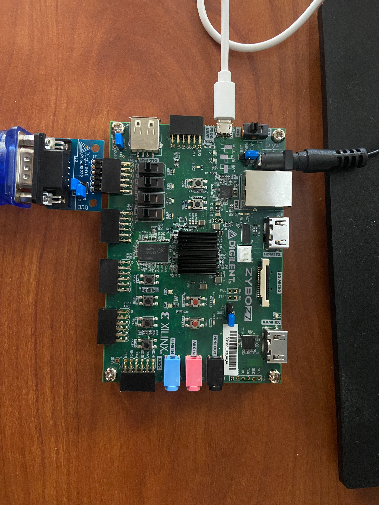
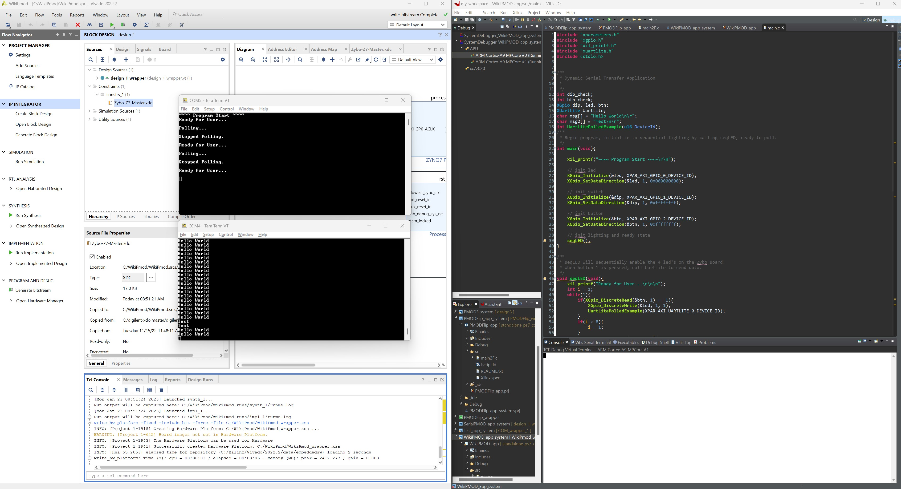

# **Communicating with Zybo using RS232 PMOD**

## Setup
- Open Vivado and Create a new Project and choose RTL Project
- Next, click on the boards tab and find **Zybo Z7-20**. If the board is not listed, make sure you have all board files downloaded from Digilent.
- You should now be in the Vivado Design Environment. 
## Block Design in Vivado
- Under `IP INTEGRATOR` in the Flow Navigator Window, Create a Block Design. 
- Next, press the `+` Button to add an IP from the Diagram Window. 
- In the search tab, find and select `ZYNQ7 Processing System`.
- With this block now added to the design, add another IP using the same method, but search and select now for `AXI Uartlite`.
- Now, Run the Block Automation and Connection Automation Tools (Select All Automation).
We will now alter the Uartlite AXI Block to our parameters for this project. 
- Double click the block and change the `BAUD rate` to 115200.
- Find `uart_rtl`. Click the dropdown menu on the **Uartlite IP**, then delete `uart_rtl` and right click on **rx** and **tx** and click **Make External**. The default names for these pins are `tx_0` and `rx_0`
 
We will now add a few more IP Blocks for LED, Switch, and Button Control.

- Using the same method as before, search and select `AXI GPIO` to be added to the design. 
- Double click on the GPIO block and change the board interface under GPIO **(NOT GPIO 2)** to `leds4bits`.
- Repeat this process again, but this time change the interface to `sws4bits`.
- Repeat this process a final time, changing the interface to `btns4bits`. (Order of interface assignments **MATTERS**, as I use code specific to this device ID's). 
- Now that all three GPIO Blocks are added in our Design, once again run Connection Automation on all blocks.

After clicking on Regenerate Layout, your design should look like this:


## Constraints and Assignments

- The next thing to do is add the `Master XDC Files` for the **Z7**. 
- If not downloaded already, head to the `Zybo Z7` page on Digilent's site and under documentation will be a link to download the master files.
- With the master files downloaded, right-click on **constraints** under the `sources` window in Vivado and select `Add Sources`.
- A new window will appear, choose to add a new constraint and click the `Add Files` button where you will add the previously downloaded `Zybo-Z7-Master` file. '

At this stage, the **XDC** file should be viewable under the **Constraints** tab.

- Go inside the master file and uncomment the following lines:
1. Both lines under `Clock Signal`
2. All four lines under `Switches`, `Buttons`, and `LEDs`
3. Under Pmod Header JE, `PIN J15` and `PIN H15`
4. On the two JE lines, make sure they look like this:
```
#set_property -dict { PACKAGE_PIN J15   IOSTANDARD LVCMOS33 } [get_ports { rx_0 }]; #IO_25_35 Sch=je[3]                          
#set_property -dict { PACKAGE_PIN H15   IOSTANDARD LVCMOS33 } [get_ports { tx_0 }]; #IO_L19P_T3_35 Sch=je[4]
```                   

## Creating a Wrapper

One of the last things we will do before exporting is creating an HDL Wrapper for our design, and Generating a Bitstream.

-In the sources window, right click on your block design (Should be something like design_1.bd) and select `Create HDL Wrapper`. Let Vivado manage the wrapper.

-If you receive critical warnings about **PCW_UIPARAM_DDR_DQS_TO_CLK_DELAY_0 has negative value -0.050** . You can ignore this. 

- It's time to create a Bitstream, in the Flow Navigator under Program and Debug, click `Generate Bitstream` and wait (May take awhile).

## Exporting Design and Launching Vitis
At this point a window should pop up when the Bitstream has finished, click cancel to exit this pop up.

- Under **file**, select `Export `-> `Export Hardware`.
- Be sure to include the Bitstream when exporting.

With hardware exported into an `XSA`, launch `Vitis` under the **Tools** tab. You may have to make a workspace for `Vitis`.
## Vitis Program
With `Vitis` launched, we will now implement the software that will drive what we designed in Vivado.

- Create a new application by doing `File` -> `New` -> `Create New Application`
- Choose the **Create a new platform from hardware (XSA)** tab and browse to find and add your `XSA` file that we exported earlier. 
- Give a name to your application and click `Next` twice (There is nothing to change in these sections).
- Choose the `Empty Application(C)` Template and **Finish**
- Under the `Explorer` window, find your application and get to the `src` folder inside, right-click and add a new `File`. Name your file `main.c`

Add this code to `main.c` and save
```
#include "xparameters.h"
#include "xgpio.h"
#include "xil_printf.h"
#include "xuartlite.h"
#include <stdio.h>


/**
 * Dynamic Serial Transfer Application
 *
 */
int dip_check;
int btn_check;
XGpio dip, led, btn;
XUartLite UartLite;
char msg[] = "Hello World\n\r";
char msg2[] = "Test\n\r";
int UartLitePolledExample(u16 DeviceId);
/**
 * Begin program, initialize to sequential lighting by calling seqLED, ready to poll.
 */
int main(void){

	xil_printf("~~~~ Program Start ~~~~\r\n");

	// init led
	XGpio_Initialize(&led, XPAR_AXI_GPIO_0_DEVICE_ID);
	XGpio_SetDataDirection(&led, 1, 0x000000000);

	// init switch
	XGpio_Initialize(&dip, XPAR_AXI_GPIO_1_DEVICE_ID);
	XGpio_SetDataDirection(&dip, 1, 0xffffffff);

	// init button
	XGpio_Initialize(&btn, XPAR_AXI_GPIO_2_DEVICE_ID);
	XGpio_SetDataDirection(&btn, 1, 0xffffffff);

	// init lighting and ready state
	seqLED();
}

/**
 * seqLED will sequentially enable the 4 led's on the Zybo Board.
 * When button 1 is pressed, call UartLite to send data.
 */
void seqLED(void){
	xil_printf("Ready for User...\r\n\n");
	int i = 1;
	while(1){
		if(XGpio_DiscreteRead(&btn, 1) == 1){
			XGpio_DiscreteWrite(&led, 1, 1);
			UartLitePolledExample(XPAR_AXI_UARTLITE_0_DEVICE_ID);
		}
		if(i > 8){
			i = 1;
		}
		XGpio_DiscreteWrite(&led, 1, i);
		sleep(1);
		XGpio_DiscreteWrite(&led, 1, 0);
		i = 2 * i;
	}
}

/**
 * Begin sending a Character to the user's device that is connected to the Board.
 * Will send a unique character relative to a unique switch configuration.
 * Stops sending data when Button 2 is pressed.
 */
int UartLitePolledExample(u16 DeviceId)
{
	int Status;
	xil_printf("Polling...\r\n\n");
	Status = XUartLite_Initialize(&UartLite, XPAR_AXI_UARTLITE_0_DEVICE_ID);
	if(Status != XST_SUCCESS){
		xil_printf("Transfer Failed.\r\n\n");
		return XST_FAILURE;
	}
	Status = XUartLite_SelfTest(&UartLite);
	if (Status != XST_SUCCESS) {
		xil_printf("Transfer Failed.\r\n\n");
		return XST_FAILURE;
	}
	int i = 4;
	while(1){
		if(XGpio_DiscreteRead(&btn, 1) == 2){
			xil_printf("Stopped Polling.\r\n\n");
			seqLED();
		}
		if(i > 8){
			i = 4;
		}
		// Send different char based off switches
		if(XGpio_DiscreteRead(&dip, 1) == 1){
			XUartLite_Send(&UartLite, msg2, sizeof(msg2));
		}else if(XGpio_DiscreteRead(&dip, 1) == 0){
			XUartLite_Send(&UartLite, msg, sizeof(msg));
		}

		XGpio_DiscreteWrite(&led, 1, i);
		sleep(1);
		XGpio_DiscreteWrite(&led, 1, 0);
		i = 2 * i;

	}
	return XST_SUCCESS;
}
```

Back in **Explorer**, right-click on the application and `Build Project`.

## Connecting Board and Tera Term
For this demo, I was successful with this attached configuration for the Board below:


Once this configuration is complete, turn the board on.

**Common issues:**
Ensure your `jumpers` are configured correctly to allow data from the `micro-usb port` but the **POWER** to be from the wall plug-in. Also, my demo needs the RS232 PMOD to be in the JE PMOD Header. 

- Connect to two `Serial Port` sessions in **Tera Term** (I used Tera for my demo, but I'm sure other programs will work)
1. Connect to whatever COM is the RS232 and change the `BAUD `to **115200 **under `Setup`.
2. Connect to whatever COM is the cable that plugs into the micro-usb on the board and change the `BAUD `to **115200 **under `Setup`.

The last thing we need to do is to go back into `Vitis` and right-click on the application and `Program Device`. Once this is finished, right-click on the application again and choose `Run As`.

The LED's should be sequentially lighting.
You should now see in your board COM Terminal:
```
~~~ Program Start ~~~
Ready for User...
```
Begin sending data to the `RS232 COM Terminal` by pressing the **rightmost button** on the board. You should now see in this Terminal `Hello World` being repeatedly sent. If it isn't, try reloading that tera term terminal, sometimes the order in which the terminal is launched and the code is run matters.

Try flipping the **right most switch**, now the terminal should be repeatedly printing `Test`.

Finally, try pressing the **second rightmost button**, the Terminals will tell you that it has stopped sending data to the `RS232 COM terminal`.

Congratulations! That is the end of this walkthrough, below I have noted some common errors or mistakes I have made when getting this to work successfully.
### Notes