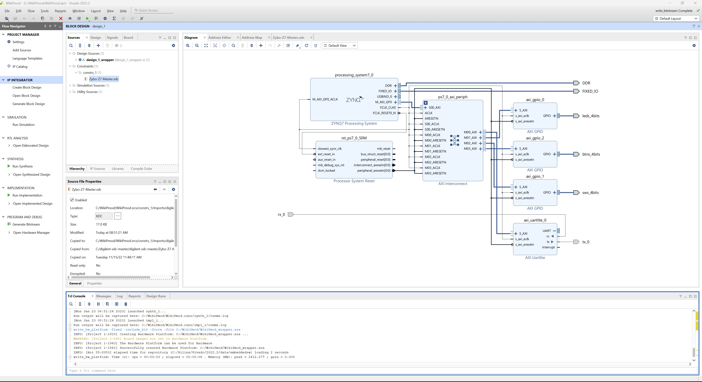

# **Communicating with Mirror Controller using Zybo Uart**

## Setup

- The setup for this demo is very similar to the `Baremetal Uart with PMOD Guide` with a key difference in the Vivado Block Design:

## Block Design in Vivado

- The Uart Block in the design **MUST** have a **BAUD Rate** of `9600` instead of 115200. Make sure your design reflects this change by double clicking the Uart Block and selecting this new BAUD Rate. Otherwise, the design is the same as in the previous demo.
- After this change, your block design should look like the picture below. 

### Constraints and Assignments

- The next thing to do is add the `Master XDC Files` for the **Z7**.
- If not downloaded already, head to the `Zybo Z7` page on Digilent's site and under documentation will be a link to download the master files.
- With the master files downloaded, right-click on **constraints** under the `sources` window in Vivado and select `Add Sources`.
- A new window will appear, choose to add a new constraint and click the `Add Files` button where you will add the previously downloaded `Zybo-Z7-Master` file. '

At this stage, the **XDC** file should be viewable under the **Constraints** tab.

- Go inside the master file and uncomment the following lines:

1. Both lines under `Clock Signal`
2. All four lines under `Switches`, `Buttons`, and `LEDs`
3. Under Pmod Header **JD**, `PIN P14` and `PIN R14`
4. On the two **JD** lines, make sure they look like this:

```
#set_property -dict { PACKAGE_PIN P14   IOSTANDARD LVCMOS33     } [get_ports { rx_0 }]; #IO_L6P_T0_34 Sch=jd_p[2]                  
#set_property -dict { PACKAGE_PIN R14   IOSTANDARD LVCMOS33     } [get_ports { tx_0 }]; #IO_L6N_T0_VREF_34 Sch=jd_n[2]
```

- Just as before, **Create the Wrapper**, **Generate the Bitstream**, **Export Hardware**, and **Launch Vitis**.

## Vitis

- The code for the program that will be programmed to the board for this demo can be found in my Projects (Will) under the name **mirrorPMOD.c**. Copy this into your project directory via the Explorer in **Vitis**.
- After pasting this code, be sure to save and run the `Build Project` Builder that is found when right-clicking the program application for this project. If there are errors during Build, fix accordingly.

## Connecting the Board

- Before we run the program, first ensure that the board's **JD** header is connected to the mirror controller, and the board is powered on and in **JTAG** mode.
- Next, connect the micro USB to the board to upload the program and code.

## Turning the Mirror On

- Now, plug in the `Mirror Controller` to power it on.

## Tera Term

- Just like in the other demo, launch a Terminal Program, I used `Tera Term` for this tutorial. Select the COM tied to the Board and set the `BAUD Rate` to **115200** (This is different to the 9600 BAUD needed for the mirror and board).

## Program Device and Run Hardware

- After your board is plugged into the laptop with `JTAG` mode, powered on and connected to **Tera Term**: right-click the `Project Application` associated with the code file and `Program Device`. Finally, again click `Project Application` and now select `Run Hardware`.
- The program is now running on the board and is ready to communicate with the `Mirror Controller`.
- To confirm functionality, your **Tera Term** terminal should say `\~\~\~\~ Program Start \~\~\~\~` follow by the first set of states to choose from.

## Guide to Board States with Switches and Buttons

- There several states and functions for each state in this demo.

### Button 1: Initialization
- Before we are able to run any other states and functions, we need to **initialize** the Mirror Controller first. To do so, press the **rightmost button** (This will be `Button 1`, to the left is `Button 2`, and so on). The controller should now be slowly moving and calibrating.

### Button 2: Rotation
- This state allows for **basic 360 degree Rotation** and **90 degree shifting**. 
- The terminal will describe what each switch will do, (`Switch 1` is the right most, `Switch 2` is to the left, and so on). 
- To exit this state, use `Button 4`.

### Button 3: Printing Message
- This state is simply a test to show the board can receive chars from the controller output and display these chars to the user's terminal.
- Note that the info and buffer is **cleared** after the **first** call to print. 
### Button 4: Dynamic Commands
- This state utilizes multiple **functions** to vary the rotation of the controller. 
- These functions include a linearly increasing rotation, a exponentially increasing rotation, and a randomly sampling rotation. 
- To exit, use `Button 1`