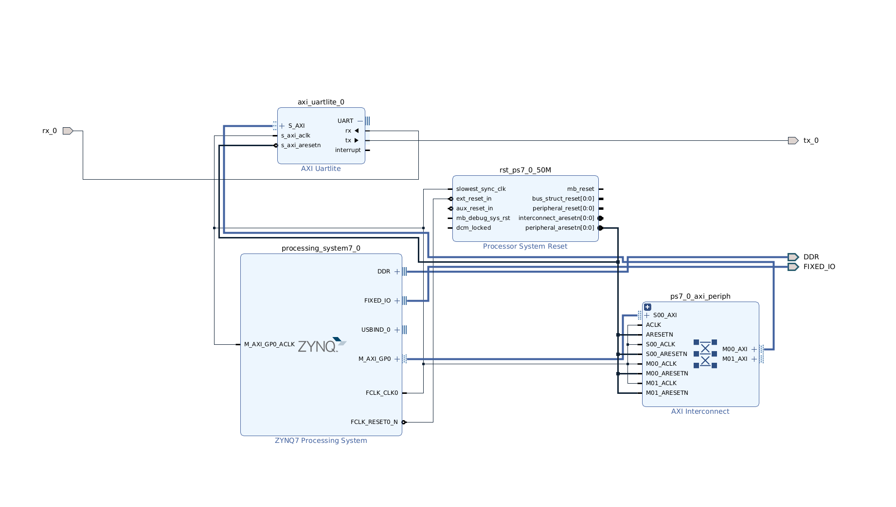

# Setup
- The following schematic shows the setup requirements for the one wire interface using the zybo pmod and the MIKROOE 3340 one wire click:


* Note: 
1. Make sure you have a reliable power source for the 5V power supply
2. Donot connect anything on the 3.3V power supply from the Zybo other than the MIKROE 3340
3. Make sure all the grounds are connected 
4. Keep the circuit on a static shielding bag

## VIVADO Setup
- Open Vivado and Create a new Project and choose RTL Project
- Next, click on the boards tab and find **Zybo Z7-20**. If the board is not listed, make sure you have all board files downloaded from Digilent.
- You should now be in the Vivado Design Environment. 
## Block Design in Vivado
- Under `IP INTEGRATOR` in the Flow Navigator Window, Create a Block Design. 
- Next, press the `+` Button to add an IP from the Diagram Window. 
- In the search tab, find and select `ZYNQ7 Processing System`.
- With this block now added to the design, add another IP using the same method, but search and select now for `AXI Uartlite`.
- Now, Run the Block Automation and Connection Automation Tools (Select All Automation).
We will now alter the Uartlite AXI Block to our parameters for this project. 
- Double click the block and change the `BAUD rate` to **9600** .
- Find `uart_rtl`. Click the dropdown menu on the **Uartlite IP**, then delete `uart_rtl` and right click on **rx** and **tx** and click **Make External**. The default names for these pins are `tx_0` and `rx_0`

OPTIONAL: You can also change the `BAUD RATE` for the Zynq Processor to 9600. Right click on the block -> `PS-PL Configuration` -> `General` -> `UART 1 Baud Rate` -> Set to `9600`


After clicking on Regenerate Layout, your design should look like this:
 

## Constraints and Assignments

- The next thing to do is add the `Master XDC Files` for the **Z7**. 
- If not downloaded already, head to the `Zybo Z7` page on Digilent's site and under documentation will be a link to download the master files.
- With the master files downloaded, right-click on **constraints** under the `sources` window in Vivado and select `Add Sources`.
- A new window will appear, choose to add a new constraint and click the `Add Files` button where you will add the previously downloaded `Zybo-Z7-Master` file. '
-  **OR** you can directly copy and paste the contents of the provided XDC file below to your XDC file

At this stage, the **XDC** file should be viewable under the **Constraints** tab.

- Go inside the master file and uncomment the following lines:
1. Under Pmod Header **JD**, `PIN P14` and `PIN R14`
2. On the two **JD** lines, make sure they look like this:

```
#set_property -dict { PACKAGE_PIN P14   IOSTANDARD LVCMOS33     } [get_ports { rx_0 }]; #IO_L6P_T0_34 Sch=jd_p[2]` 
                
#set_property -dict { PACKAGE_PIN R14   IOSTANDARD LVCMOS33     } [get_ports { tx_0 }]; #IO_L6N_T0_VREF_34 Sch=jd_n[2]

```

## Creating a Wrapper

One of the last things we will do before exporting is creating an HDL Wrapper for our design, and Generating a Bitstream.

-In the sources window, right click on your block design (Should be something like design_1.bd) and select `Create HDL Wrapper`. Let Vivado manage the wrapper.

-If you receive critical warnings about **PCW_UIPARAM_DDR_DQS_TO_CLK_DELAY_0 has negative value -0.050** . You can ignore this. 

- It's time to create a Bitstream, in the Flow Navigator under Program and Debug, click `Generate Bitstream` and wait (May take awhile).

## Exporting Design and Launching Vitis
At this point a window should pop up when the Bitstream has finished, click cancel to exit this pop up.

- Under **file**, select `Export `-> `Export Hardware`.
- Be sure to include the Bitstream when exporting.

With hardware exported into an `XSA`, launch `Vitis` under the **Tools** tab. You may have to make a workspace for `Vitis`.

# Alternatively
- You can use the following files to skip the Vivado design setup

**Block Design File:** [one_wire.tcl](uploads/71f908e98bf19d7405473dccc699eaf1/one_wire.tcl)

**Constraints File:** [one_wire_constraints.xdc](uploads/6a4677436d69aa259de1496131e24656/one_wire_constraints.xdc)

**Bitstream File:**[one_wire_wrapper.xsa](uploads/78c8107c8ae02dae4091aa1860b52f09/one_wire_wrapper.xsa)


## Vitis Program
With `Vitis` launched, we will now implement the software that will drive what we designed in Vivado.

- Create a new application by doing `File` -> `New` -> `Create New Application`
- Choose the **Create a new platform from hardware (XSA)** tab and browse to find and add your `XSA` file that we exported earlier **OR** the one provided.
- Give a name to your application and click `Next` twice (There is nothing to change in these sections).
- Choose the `Empty Application(C++)` Template and **Finish**
- Under the `Explorer` window, find your application and get to the `src` folder inside, right-click and add a new `File`. Name your file `main.cpp`

**Copy the contents from [this](https://gitlab.ssec.wisc.edu/nextgenshis/one-wire/-/blob/main/Read_temperature/one-wire_1S.c) following file to your empty C++ file:**


## Understanding the code

### There are two aspect to the functions provided. The following lists the functions that you can use:
1. initBoard() - must be called in the beginning every time to initialise the drivers and the board
2. getTemperature()
3. get5Readings()
4. findROMID()
5. getTemperatureROM(64 bit ROMID)

 **When using just one sensor on the data line**
- ONLY use initBoard(), getTemperature(), get5Readings(), findROMID()

**When using more than one sensor on the data line**

- ONLY use getTemperatureROM(ROMID)

> You must ensure that you find the ROM of each sensor before using this method. For this use the findROMID() method with only that specific sensor connected to the data line.
Once you have all the ROMIDs of the sensors on the line, you can use the getTemperaureROM() method to address any specific sensor


## Launching Application
Back in **Explorer**, right-click on the application and `Build Project`.
1. Make sure the Zybo is set to JTAG, after which you can connect the USB to the your PC
2. Switch on the Zybo and open the terminal window right next to your Vitis application
3. Search for the USB port being used using: `ls /dev/ttyUSB*`
4. After you know which one is being used, open minicom or screen to see the responses from the one wire interface

*FOR MINICOM:*
`sudo minicom -D /dev/ttyUSB1 -b 9600`


*FOR SCREEN:*`sudo screen /dev/ttyUSB1 9600`

> The `Baud Rate` is set to 9600 here, **HOWEVER** if you have not changed the baud rate of the ZYNQ to 9600, then type 115200 instead

> ttyUSB1 is based on the port being used on my computer, yours MIGHT be different

5. Go to your vitis application, right click on the application project (the main folder you named your project on) and click on `Run as` -> `Launch Hardware`

6. You can see the device temperature being read on the terminal window

## Result


(the extra wiring is because i have an oscilloscope connected)


## Debugging

**PLEASE use an oscilloscope**
- Connect it to the data line of the sensor and the ground
- I have observed that the application does't start when you run the hardware in the first go, try running it the second time and it should work. You will also be able to see the signal on the oscilloscope
- Initially it might give 'invalid data' as a response but that is fixed up after running the program a couple of times
- If the problem still persists, you can use the following C files to debug it individually. I have print statements to analyse the sent commands and responses. Please read the datasheets attached in the resources section to understand the code. 

([**1 sensor**](https://gitlab.ssec.wisc.edu/nextgenshis/one-wire/-/blob/main/Read_temperature/one-wire_1S.c))
([**2 sensors**](https://gitlab.ssec.wisc.edu/nextgenshis/one-wire/-/blob/main/Read_temperature/one-wire_2S.c))

- Sometimes the code might run into a while loop if no data is being sent back. If you simply `Launch hardware` again through Vitis, it might not work and it will show you the following result:


(the first channel is connected to the data line, the second is connected to the tx of the zybo to observe the responses, you can choose not to include the second channel)


- Please switch off the Zybo and switch it on again, and it should work fine then (after launching the hardware twice)
- You can also unplug the 5V power source alternatively and connect it again
(this usually happens because the DS2480B chip used was in data mdoe when it got stuck in the while loop and would not work until reset)

## Resources

[MIKROE 3340 ONE WIRE CLICK](https://www.mikroe.com/uart-1-wire-click)

[MIKROE 3340 SCHEMATIC](https://download.mikroe.com/documents/add-on-boards/click/uart-1-wire/UART-1-wire-click-schematic-v100.pdf)

- MIKROE 3340 library for one wire: (This was used as a reference for our own code as this only works with their own dev boards)

    [uart1wire.c](uploads/438a4b7116eef66e3213fc10bc0829f5/uart1wire.c)
    [uart1wire.h](uploads/1c2b0f6daa22a8f9447c3ecf4bb9df3e/uart1wire.h)

[DS2480B DATASHEET](https://download.mikroe.com/documents/datasheets/DS2480B.pdf)

[Understanding DS2480B](https://www.analog.com/media/en/technical-documentation/tech-articles/using-the-ds2480b-serial-1wire-line-driver.pdf)
