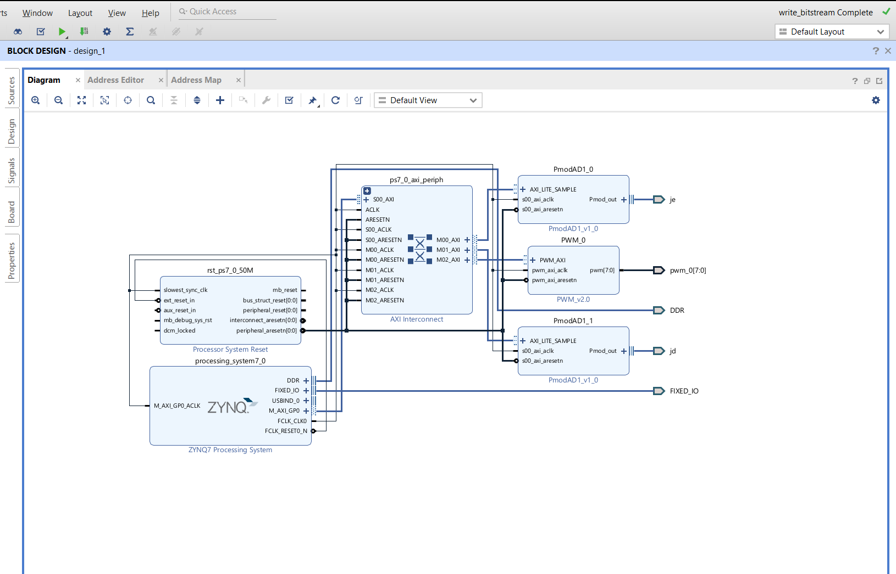

# **Summary of Development and Progress with PID Controller using Zynq and C Code**

This page is to save and provide the resources and progress made on using a Zynq Processing block for the Zybo Board along with the C code developed for the board. Please be aware this was not a completed Experiment, as we moved away from the Zynq design to the more ideal design that does not need to use the Zynq in the design. This is meant as a starting place/where we left off, if one is considering the Zynq Approach.

## **Block Design**

Below is a picture of the Block Design created (Note you will have to manually make external the PWM outputs using the editor):

Below is the Constraints that were edited:
```
##Pmod Header JC                                                                                                                  
set_property -dict { PACKAGE_PIN V15   IOSTANDARD LVCMOS33     } [get_ports { pwm_0[0] }]; #IO_L10P_T1_34 Sch=jc_p[1]   			 
set_property -dict { PACKAGE_PIN W15   IOSTANDARD LVCMOS33     } [get_ports { pwm_0[1] }]; #IO_L10N_T1_34 Sch=jc_n[1]		     
set_property -dict { PACKAGE_PIN T11   IOSTANDARD LVCMOS33     } [get_ports { pwm_0[2] }]; #IO_L1P_T0_34 Sch=jc_p[2]              
set_property -dict { PACKAGE_PIN T10   IOSTANDARD LVCMOS33     } [get_ports { pwm_0[3] }]; #IO_L1N_T0_34 Sch=jc_n[2]              
set_property -dict { PACKAGE_PIN W14   IOSTANDARD LVCMOS33     } [get_ports { pwm_0[4] }]; #IO_L8P_T1_34 Sch=jc_p[3]              
set_property -dict { PACKAGE_PIN Y14   IOSTANDARD LVCMOS33     } [get_ports { pwm_0[5] }]; #IO_L8N_T1_34 Sch=jc_n[3]              
set_property -dict { PACKAGE_PIN T12   IOSTANDARD LVCMOS33     } [get_ports { pwm_0[6] }]; #IO_L2P_T0_34 Sch=jc_p[4]              
set_property -dict { PACKAGE_PIN U12   IOSTANDARD LVCMOS33     } [get_ports { pwm_0[7] }]; #IO_L2N_T0_34 Sch=jc_n[4]              
                                                                                                                                 
                                                                                                                                 
##Pmod Header JD                                                                                                                  
set_property -dict { PACKAGE_PIN T14   IOSTANDARD LVCMOS33     } [get_ports { jd_pin1_io }]; #IO_L5P_T0_34 Sch=jd_p[1]                  
set_property -dict { PACKAGE_PIN T15   IOSTANDARD LVCMOS33     } [get_ports { jd_pin2_io }]; #IO_L5N_T0_34 Sch=jd_n[1]				 
set_property -dict { PACKAGE_PIN P14   IOSTANDARD LVCMOS33     } [get_ports { jd_pin3_io }]; #IO_L6P_T0_34 Sch=jd_p[2]                  
set_property -dict { PACKAGE_PIN R14   IOSTANDARD LVCMOS33     } [get_ports { jd_pin4_io }]; #IO_L6N_T0_VREF_34 Sch=jd_n[2]             
set_property -dict { PACKAGE_PIN U14   IOSTANDARD LVCMOS33     } [get_ports { jd_pin7_io }]; #IO_L11P_T1_SRCC_34 Sch=jd_p[3]            
set_property -dict { PACKAGE_PIN U15   IOSTANDARD LVCMOS33     } [get_ports { jd_pin8_io }]; #IO_L11N_T1_SRCC_34 Sch=jd_n[3]            
set_property -dict { PACKAGE_PIN V17   IOSTANDARD LVCMOS33     } [get_ports { jd_pin9_io }]; #IO_L21P_T3_DQS_34 Sch=jd_p[4]             
set_property -dict { PACKAGE_PIN V18   IOSTANDARD LVCMOS33     } [get_ports { jd_pin10_io }]; #IO_L21N_T3_DQS_34 Sch=jd_n[4]             
                                                                                                                                 
                                                                                                                                 
##Pmod Header JE                                                                                                                  
set_property -dict { PACKAGE_PIN V12   IOSTANDARD LVCMOS33 } [get_ports { je_pin1_io }]; #IO_L4P_T0_34 Sch=je[1]						 
set_property -dict { PACKAGE_PIN W16   IOSTANDARD LVCMOS33 } [get_ports { je_pin2_io }]; #IO_L18N_T2_34 Sch=je[2]                     
set_property -dict { PACKAGE_PIN J15   IOSTANDARD LVCMOS33 } [get_ports { je_pin3_io }]; #IO_25_35 Sch=je[3]                          
set_property -dict { PACKAGE_PIN H15   IOSTANDARD LVCMOS33 } [get_ports { je_pin4_io }]; #IO_L19P_T3_35 Sch=je[4]                     
set_property -dict { PACKAGE_PIN V13   IOSTANDARD LVCMOS33 } [get_ports { je_pin7_io }]; #IO_L3N_T0_DQS_34 Sch=je[7]                  
set_property -dict { PACKAGE_PIN U17   IOSTANDARD LVCMOS33 } [get_ports { je_pin8_io }]; #IO_L9N_T1_DQS_34 Sch=je[8]                  
set_property -dict { PACKAGE_PIN T17   IOSTANDARD LVCMOS33 } [get_ports { je_pin9_io }]; #IO_L20P_T3_34 Sch=je[9]                     
set_property -dict { PACKAGE_PIN Y17   IOSTANDARD LVCMOS33 } [get_ports { je_pin10_io }]; #IO_L7N_T1_34 Sch=je[10]                    
```

## **Code Developed and Utilized**

[main.c](uploads/1893824ec1b97d0c3e2af009f7f210dc/main.c)

[mainPID.c](uploads/89dbf97f41beed44ab7e98b8cc9a6238/mainPID.c)

[pid.c](uploads/25ed9ac861023b724e856645ff4862ee/pid.c)

[pid.h](uploads/4a959fbcc4b2662aec74998da6df1281/pid.h)

[pid_example.cpp](uploads/a5e8056293618abcd16d3a5bc3ba9348/pid_example.cpp)

**NOTE: The PmodAD1.c Driver was edited to fix an issue that we are currently debugging with Digilient's Original Driver, the ADC is not reading correctly without this temporary edit, your mileage may vary as this is an ongoing problem with the drivers**


[PmodAD1.c](uploads/12e3bab2d753d21f38b6310dda4f28fc/PmodAD1.c)
