### Package design
---
The test design module needs to be placed in a directory alone, so it can be packaged:
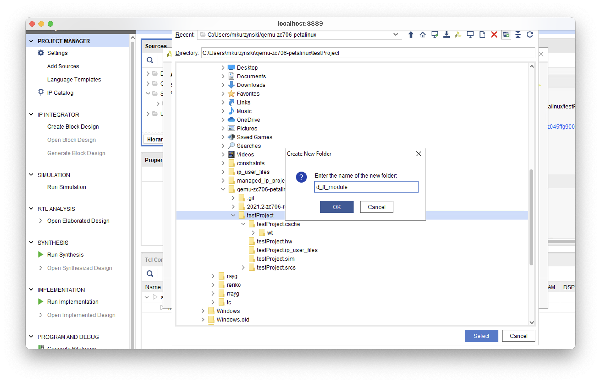

Fill in the module with code:
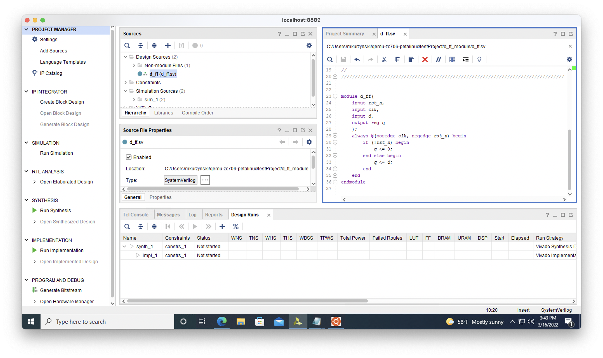

search package ip:
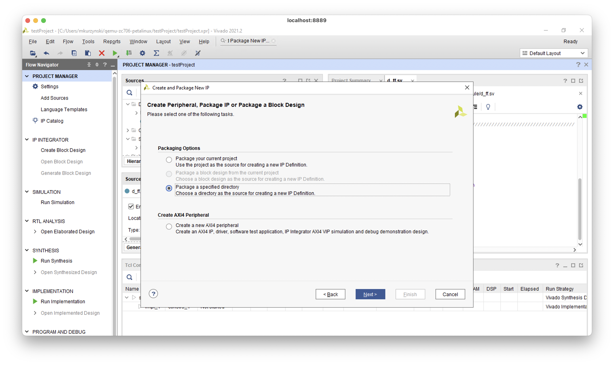

Click package:
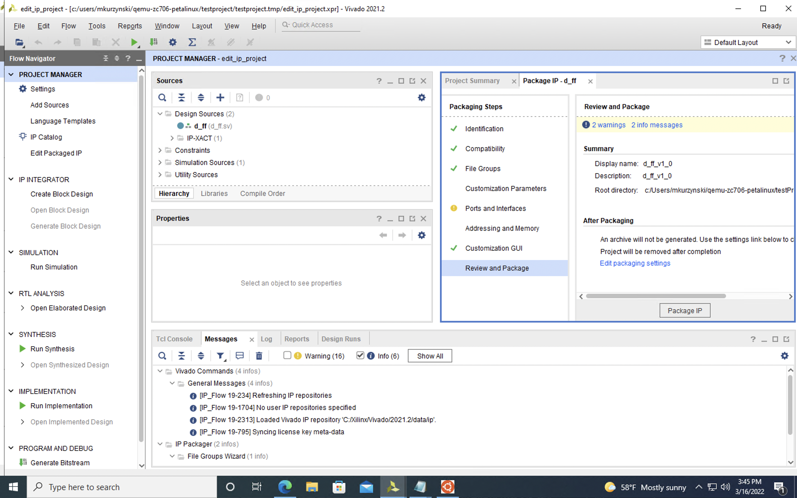

### Board design and constraints
---
create board design:
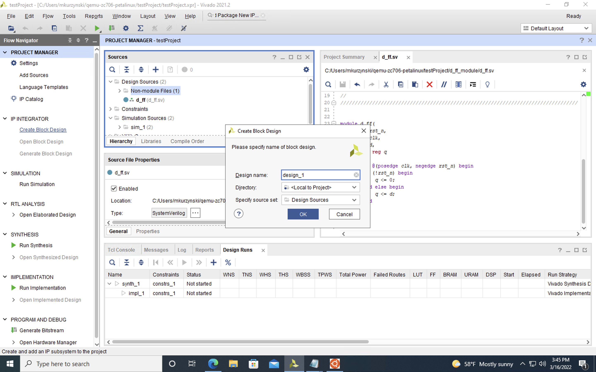

add zynq and test module:
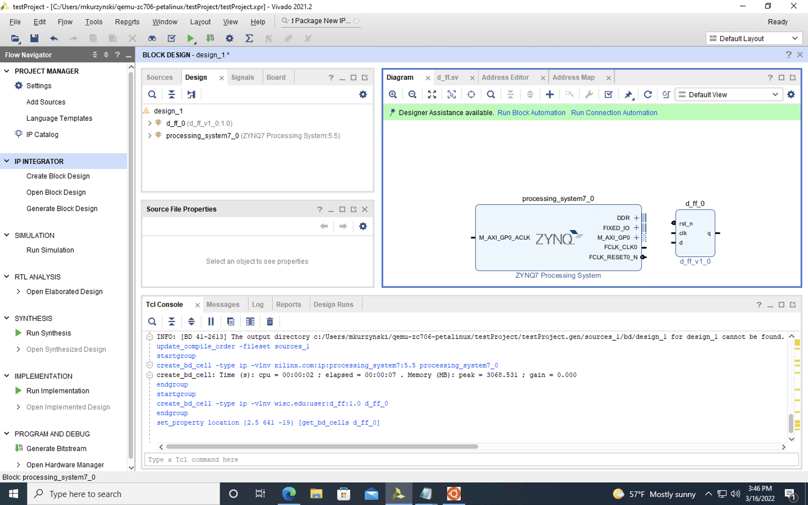

Add constraints file from Xilinx:
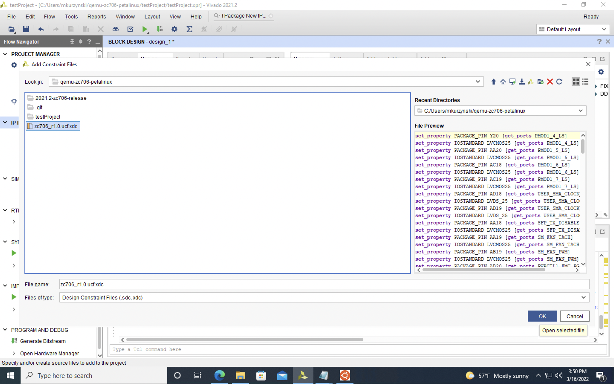

Find desired pins:
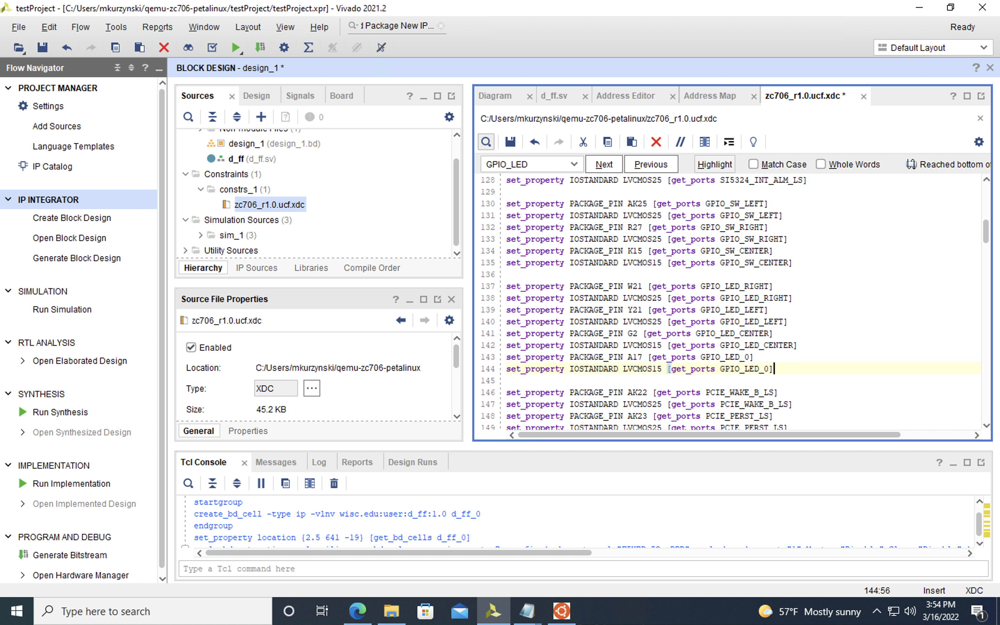

Replace with test connections:
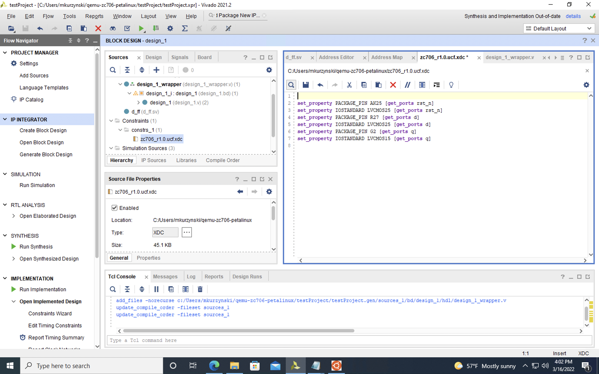

After running block and connection automation, right click the board design and create VHDL wrapper (Warning about pins will show):
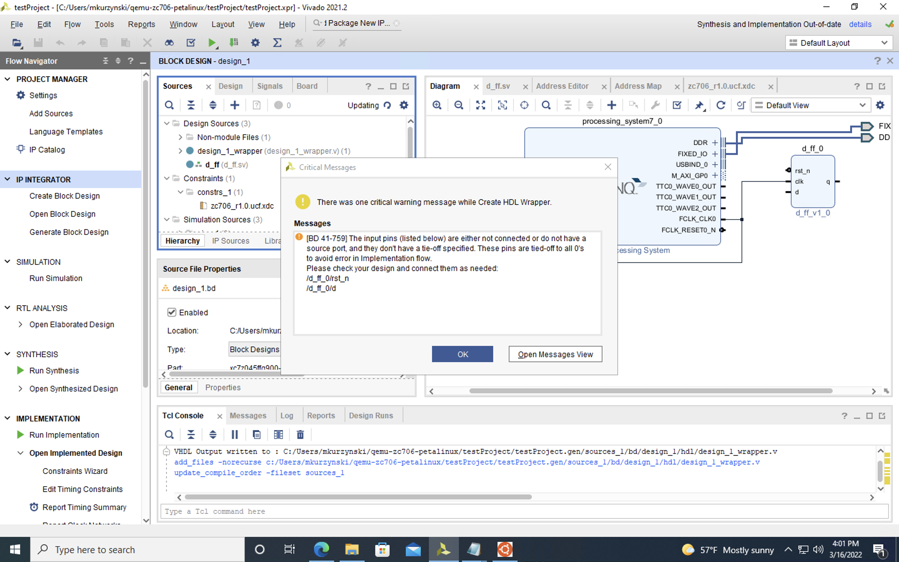

To fix the warnings make the pins external and change them to the correct name:
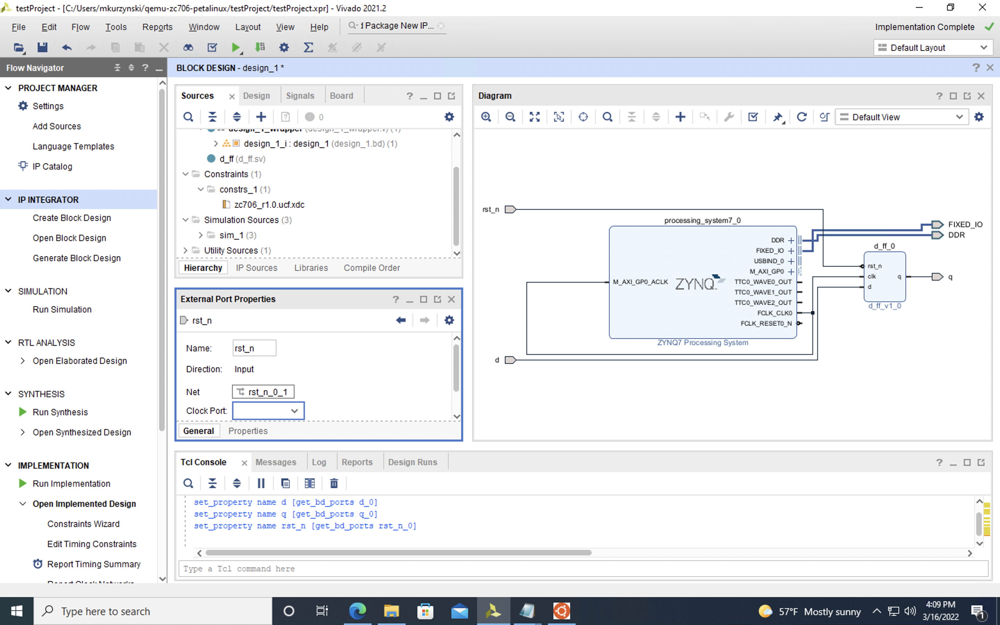

Run synthesis and implementation:
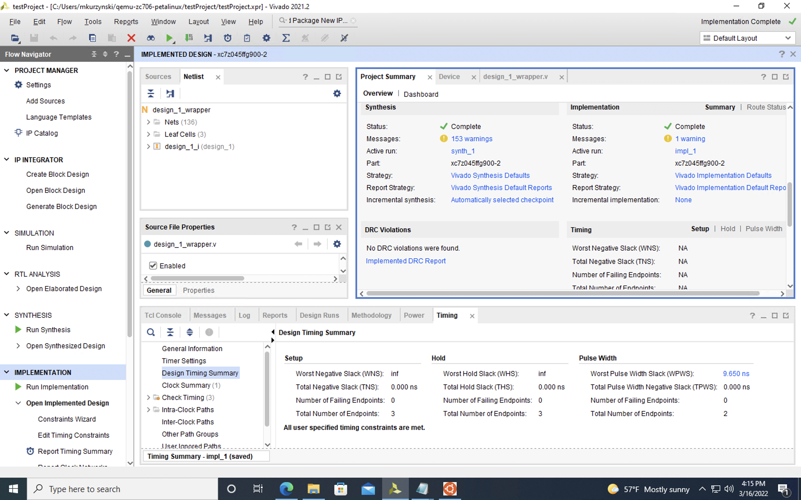

