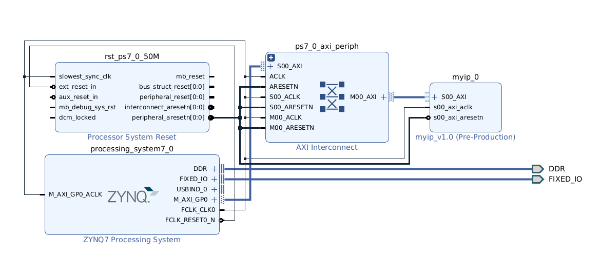

## Introduction

To complete this tutorial, I first recommend going over [the Linux mutex guide](Linux Kernel Module for Hardware Mutex) which will help you understand how kernel modules work.

In this tutorial, we will design a custom device which performs simple [Q number](https://en.wikipedia.org/wiki/Q_(number_format)#Math_operations) operations in verilog, use it in Vitis, and use it in Petalinux.

## Creating a custom peripheral

Xilinx auto-generates [questionable AXI Slave Code](https://support.xilinx.com/s/question/0D52E00006hpXPLSA2/custom-axilite-slave-ip-causing-microblaze-to-stall?language=en_US) which we will slightly modify to delay memory read requests when pipe-lining math operations.

To generate a brand new AXI device, open up Vivado, and go to `Tools -> Create and Package new IP...` and select `Create a new AXI4 peripheral`. We will leave interrupt support off, and use 4 slave registers, with all other options defaulted. 

To edit this IP right away, on the final menu screen select Edit IP. Alternatively, save the IP to your new IP repository folder and open it with your favorite text editor.

## Modifying the AXI-Lite Slave interface

The are a couple things we must do to make a useful slave interface. The first thing is exposing the slave registers that we would like to use to the device we would like to connect. For our design, we will need access to the first 3 slave registers.

To expose these registers, go to `myip_v1_0_S00_AXI.v` line 107 where the slave registers are declared. Simply move lines 107-109 to the top of your module definition and declare the registers as outputs.
Additionally, we will add a couple more signals

- expose the `slv_reg_wren` signal just like you did the `slv_regX`s, so that our device knows when a new transaction should take place.
- add a `done` signal as an input wire, so that we can stall AXI read requests until the device has finished processing the last valid data, given valid data is written when `slv_reg_wren` is high.
- add an `out` signal so that our device's output can be memory mapped to the AXI interface

```verilog
	// Users to add ports here
output reg [C_S_AXI_DATA_WIDTH-1:0]	slv_reg0,
output reg [C_S_AXI_DATA_WIDTH-1:0]	slv_reg1,
output reg [C_S_AXI_DATA_WIDTH-1:0]	slv_reg2,
input wire [C_S_AXI_DATA_WIDTH-1:0]	out,
output wire				slv_reg_wren,
input wire				done,
	// User ports ends
```

Next, we need to add these port connections to `myip_v1_0.v` to the `myip_v1_0_S00_AXI` module in your design like so:

```verilog
wire [C_S00_AXI_DATA_WIDTH-1:0]	slv_reg0;
wire [C_S00_AXI_DATA_WIDTH-1:0]	slv_reg1;
wire [C_S00_AXI_DATA_WIDTH-1:0]	slv_reg2;
wire				done;
wire				slv_reg_wren;
wire [C_S_AXI_DATA_WIDTH-1:0]	out;
// Instantiation of Axi Bus Interface S00_AXI
myip_v1_0_S00_AXI # ( 
	.C_S_AXI_DATA_WIDTH(C_S00_AXI_DATA_WIDTH),
	.C_S_AXI_ADDR_WIDTH(C_S00_AXI_ADDR_WIDTH)
) myip_v1_0_S00_AXI_inst (
	.S_AXI_ACLK(s00_axi_aclk),
...
	.S_AXI_RREADY(s00_axi_rready),
	.slv_reg0(slv_reg0),
	.slv_reg1(slv_reg1),
	.slv_reg2(slv_reg2),
	.done(done),
        .slv_reg_wren(slv_reg_wren),
        .out(out)
);
```
Next we need to manipulate the `ARREADY` (Read Address Ready) so that a read request is not permitted until `done` is high. To do this, open `myip_v1_0_S00_AXI.v` and find line 321. Change the line like so:
```verilog
	if (~axi_arready && S_AXI_ARVALID && done)
```
To make the data from the device accessible during a read transaction, find line 376 and replace `slv_reg3` with `out` like so:
```verilog
	// Address decoding for reading registers
      case ( axi_araddr[ADDR_LSB+OPT_MEM_ADDR_BITS:ADDR_LSB] )
        2'h0   : reg_data_out <= slv_reg0;
        2'h1   : reg_data_out <= slv_reg1;
        2'h2   : reg_data_out <= slv_reg2;
        2'h3   : reg_data_out <= out;
        default : reg_data_out <= 0;
      endcase

```

Now that we have prepped the interface for our slave device, it's time to implement the device itself. For clarification on why certain values are selected, feel free to checkout the [test benches](https://gitlab.ssec.wisc.edu/nextgenshis/ip_repo/-/tree/5ed59c7a6fd52d65a420a9075856374eb8e94fbe/qnumbers_1_0/bench) which show our assumptions about the device.

## Adding Custom Sources

Our custom device and its sources are located [here](https://gitlab.ssec.wisc.edu/nextgenshis/ip_repo/-/tree/5ed59c7a6fd52d65a420a9075856374eb8e94fbe/qnumbers_1_0/src). Clone or zip this repository so you can add the sources to your device. (You don't need ad1_spi.v or adc_model.v since we're not using them for this design)

Once this folder is cloned, go to the `+` symbol in your sources and add the files. They will automatically be copied to the `src` folder of your custom device. Now open `myip_v1_0.v` back up, and add your device called `newwrapper` to the bottom of the file:

```verilog
// Add user logic here
newwrapper #(.CALC_WIDTH(64), .OP_WIDTH(32)) QMATH(
  .clk(s00_axi_aclk),
  .rst(~s00_axi_aresetn),
  .slv_reg0(slv_reg0),
  .slv_reg1(slv_reg1),
  .slv_reg2(slv_reg2),
  .slv_reg_wren(slv_reg_wren),
  .test_out(out),
  .done(done)
);
// User logic ends
endmodule
```
## Finish Packaging IP

Now that we have our device implemented it, it's time to save the IP and import it into a design with a Zynq or Microblaze! 

To save your IP, find the tab labeled `Package IP - myip` and click every box which does not have a green check mark, and click the blue link to take the default action until the check marks are all green.

The last error you will have is `FREQ_HZ` not being defined. To fix this, you can go to `Ports and Interfaces`, right click and select `Edit Interface... -> Parameters -> Requires User Setting -> FREQ_HZ`, select the `->` arrow to add it, and change the value to `50MHZ` which is what we will most likely be using.

## Block Design

Now we need to add our IP to our block design, so close the temporary IP Packaging project, and go back to your Vivado project. Note the location where `myip_v1` was saved.

To add our custom IP to the block design, we must first add the IP location. Go to `Tools -> Settings... -> IP -> Repository` and make sure the folder containing your design is one of the repository sources.

Open or create a new block design, and place just a Zynq Processing System, and myip_v1. Select all the default options for Block and Connection automation, and you will have the following block design created:



Generate the bitstream, export the hardware, and you're finished with the hard part!

**To double check that your design is correct, look at the timing results in Design Runs and compare to these. If these numbers match, but you are not getting the expected result, make sure you have connected all your signals, especially `out`**

|  WNS   |  TNS   |  WHS   |  THS   | 
| ---    | ---    | ---    | ---    |
| 12.769 | 0.000  |  0.043 |  0.000 |

---

Our device works in the following way.
- Slave register 0 is the first input number to perform an operation on.
- Slave register 1 is the second input number.
- Slave register 2 is for both the operation and decimal point
  - if bit 0 == 1 MUL else ADD
  - 5 bits for decimal point, since clog2(32) => 5. bits 5-1 are used since the bit 0 is used for the operation

For the next part, you can skip ahead to Linux, just do Baremetal, or both.

## Baremetal

Open Vitis and create a new project with the hardware file you have exported. Vivado is super nice in that along with auto-generating AXI slave code for your device, it also auto-generates a baremetal C template here `ip_repo/myip_1_0/drivers/myip_v1_0/src`

`myip.h` contains the slave register offsets and fairly useless write register macros that you don't have to use, and `xparameters.h` (Accessible from Vitis) contains the base address of your device. we will copy `myip.h` to our vitis project, create a new `main.c` file, and copy that `main.c` file into our ip_repo when we are done to save that code in the ip_repo. 

Copy [this](https://gitlab.ssec.wisc.edu/nextgenshis/ip_repo/-/blob/be570b47773b07d21e6d5a071bccf57707249b26/qnumbers_1_0/drivers/qnumbers_v1_0/src/qnumbers.c) file to `main.c`, build the project, and then open a serial connection to the device with either `screen` or `minicom`:
- `screen /dev/ttyUSB1 115200`
- `minicom -D /dev/ttyUSB1 -b 115200`

You should see the following printout over and over:

```
=============================
OP: +
inA: DEADA55    inB: FACEB00F
Q32.0 | 8B98A64
Q31.1 | 8B98A64
Q30.2 | 8B98A64
Q29.3 | 8B98A64
Q28.4 | 8B98A64
Q27.5 | 8B98A64
Q26.6 | 8B98A64
Q25.7 | 8B98A64
Q24.8 | 8B98A64
Q23.9 | 8B98A64
Q22.10 | 8B98A64
Q21.11 | 8B98A64
Q20.12 | 8B98A64
Q19.13 | 8B98A64
Q18.14 | 8B98A64
Q17.15 | 8B98A64
Q16.16 | 8B98A64
Q15.17 | 8B98A64
Q14.18 | 8B98A64
Q13.19 | 8B98A64
Q12.20 | 8B98A64
Q11.21 | 8B98A64
Q10.22 | 8B98A64
Q9.23 | 8B98A64
Q8.24 | 8B98A64
Q7.25 | 8B98A64
Q6.26 | 8B98A64
Q5.27 | 8B98A64
Q4.28 | 8B98A64
Q3.29 | 8B98A64
Q2.30 | 8B98A64
Q1.31 | 8B98A64
=============================
=============================
OP: *
inA: DEADA55    inB: FACEB00F
Q32.0 | 80000000
Q31.1 | 80000000
Q30.2 | 80000000
Q29.3 | 80000000
Q28.4 | 80000000
Q27.5 | 80000000
Q26.6 | 80000000
Q25.7 | 80000000
Q24.8 | 80000000
Q23.9 | 80000000
Q22.10 | 80000000
Q21.11 | 80000000
Q20.12 | 80000000
Q19.13 | 80000000
Q18.14 | 80000000
Q17.15 | 80000000
Q16.16 | 80000000
Q15.17 | 80000000
Q14.18 | 80000000
Q13.19 | 80000000
Q12.20 | 80000000
Q11.21 | 80000000
Q10.22 | 80000000
Q9.23 | 80000000
Q8.24 | B7BB6FF9
Q7.25 | DBDDB7FC
Q6.26 | EDEEDBFE
Q5.27 | F6F76DFF
Q4.28 | FB7BB6FF
Q3.29 | FDBDDB7F
Q2.30 | FEDEEDBF
Q1.31 | FF6F76DF
=============================

```

## Linux
