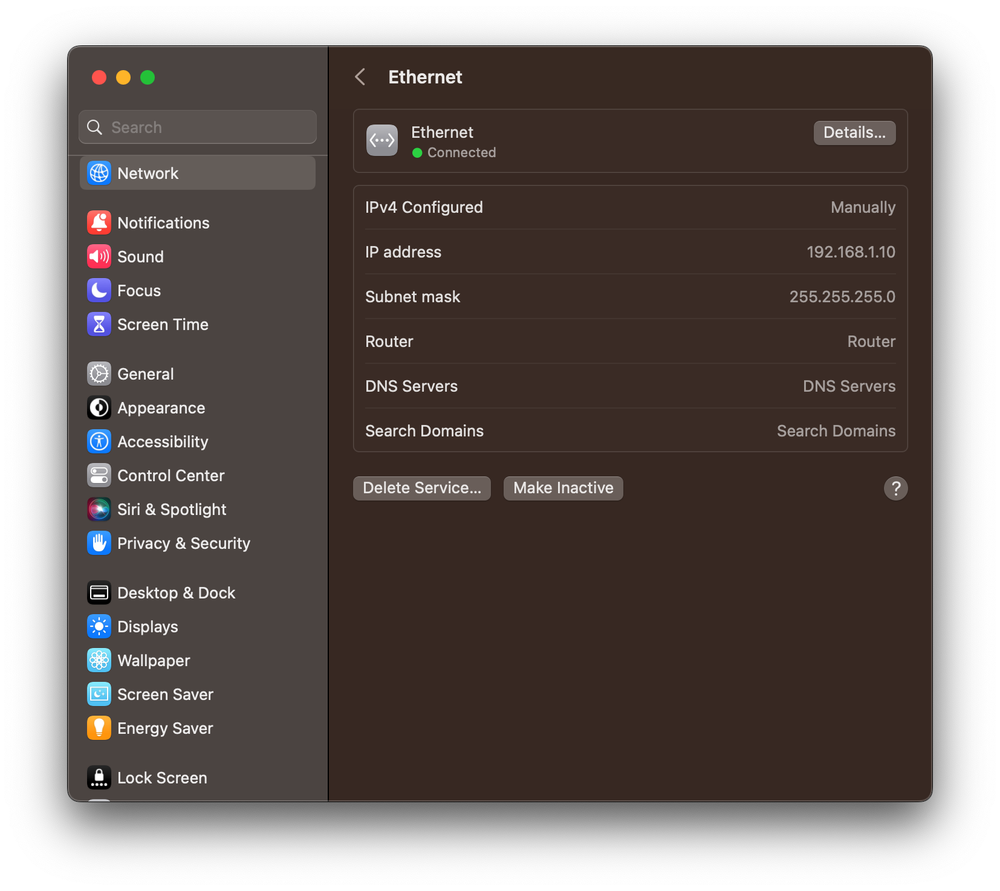

# Host Configuration
After connecting the FPGA and your computer together with an ethernet cable, on your host computer, choose an ip address and a subnet. For example, what I have below:

# Device configuration
run `vi /etc/network/interfaces` and change eth0 to the following, where `192.168.20` is the new device static ip, and `192.168.1.10` is the host ip:
```
iface eth0 inet static
address 192.168.1.20
gateway 192.168.1.10
netmask 255.255.255.0
```
Now restart the interface:
```
ifdown eth0 && ifup eth0
```