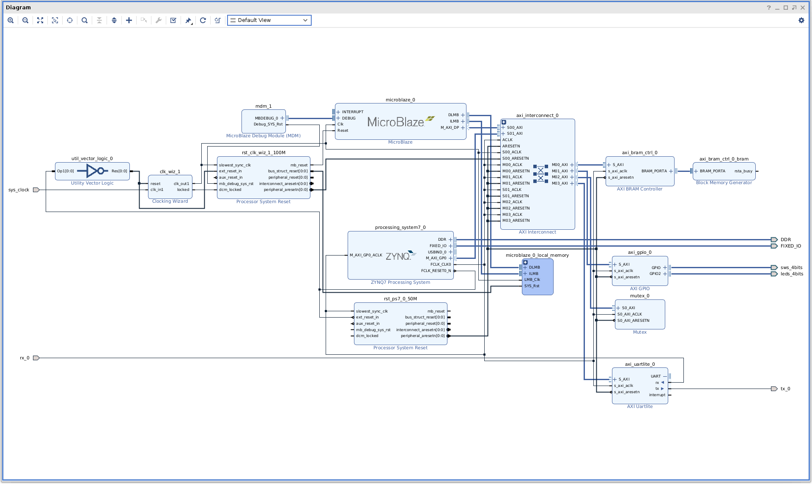

## Introduction

[Advanced eXtensible Interface (AXI)](https://en.wikipedia.org/wiki/Advanced_eXtensible_Interface) is a communication bus developed by ARM. It is used in the Xilinx FPGAs. For this project, we will be using AXI4, although I believe AXI4-Lite is acceptable for communication with the [Mutex IP](https://docs.xilinx.com/v/u/en-US/pg117-mutex)

[There are three types of AXI4 interfaces:](https://docs.xilinx.com/v/u/en-US/ug761_axi_reference_guide)
- AXI4—For high-performance memory-mapped requirements.
- AXI4-Lite—For simple, low-throughput memory-mapped communication (for example,
to and from control and status registers).
- AXI4-Stream—For high-speed streaming data.

*To skip manual Block Design and Microblaze setup, use [this](https://gitlab.ssec.wisc.edu/mkurzynski/petalinux-zybo-z7-20/-/blob/BlockMemMutex/hw/design_1_wrapper.xsa) `.xsa` file for the Petalinux part.*

*To skip the module creation, you can use [this](https://gitlab.ssec.wisc.edu/mkurzynski/petalinux-zybo-z7-20/-/tree/BlockMemMutex/os) folder as your base Petalinux project.*

## Block Design

Our block design's purpose is to create a shared memory window between a Microblaze and the Zynq. We will use a BRAM controller and generator to create the physical registers, and connect both processors to the slave AXI interconnect ports. One of the master ports will be for a Uartlite IP for sending messages over the RS232 Pmod header to either the mirror controller, or a USB adapter for testing purposes. Another port is for the Mutex used to synchronize the Zynq and Microblaze. The final port is LEDs for debug purposes, and will blink an "SOS" signal when the Microblaze encounters an error.



To recreate this design, you can run [this](https://gitlab.ssec.wisc.edu/mkurzynski/petalinux-zybo-z7-20/-/blob/BlockMemMutex/hw/design_1.tcl) tcl script by opening Vivado and going to `Tools -> Run Tcl Script...`

In addition to the Block Design above, a constraints file is needed for our custom external pins of the Uartlite. To add a constraints file, go to the plus button `Add Sources -> Add or create constraints` and create a new file. Paste these lines to tie the RX and TX pins to the Pmod header
```
set_property -dict { PACKAGE_PIN P14   IOSTANDARD LVCMOS33     } [get_ports { rx_0 }]; #IO_L6P_T0_34 Sch=jd_p[2]                  
set_property -dict { PACKAGE_PIN R14   IOSTANDARD LVCMOS33     } [get_ports { tx_0 }]; #IO_L6N_T0_VREF_34 Sch=jd_n[2]
```

## Microblaze Code

We need to add an elf file to the Microblaze's block memory so that messages copied into the shared memory buffer. To do this, we will create a Project in Vitis, compile a program, and "associate the elf file" in the block design.

To create the project you must import the hardware description file. To generate one, go to `File -> Export -> Export Hardware...`

Copy [this](https://gitlab.ssec.wisc.edu/mkurzynski/petalinux-zybo-z7-20/-/blob/BlockMemMutex/sw/main.c) file into your src folder of your Vitis project. Build the project, and inside the `Debug` folder, you should have `<project name>.elf`. Go back to your Vivado project, open the block design, and right click on the Microblaze IP. Go to `Associate ELF Files...` and click the three dots by `Design Sources / design_1 / microblaze_0` to select the elf file. Now, export the `.xsa` file again, and we will use it in the Petalinux build.


# Petalinux

Petalinux is a wrapper around other tools like Yocto and Bitbake design by Xilinx to work with 

## Setup
