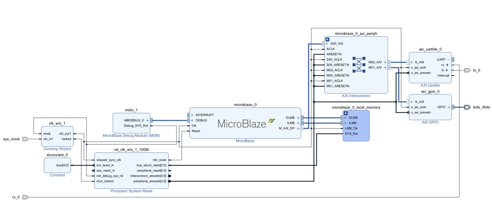

## Setup
- Create Project
- Leave default of RTL Project (Do not specify sources)
- Click on boards, then search (Ex. Zybo Z7-20)

## Block Design
- under `IP INTEGRATOR` click **Create Block Design**
- Press `+` to add IP
- Search **MicroBlaze** (not MCS)
- Click **Run Block Automation**
- In the menu, change local memory to a larger value, like 32KB
- After Block Automation completes, click **Run Connection Automation** and click **All Automation**

Next, we need to connect our board signals to the IP. Click on **Board** in the upper left next to **Sources**, **Design**, and **Signals**

- Click on **System Clock** and drag it onto the Block Design. It should auto connect to the Clocking Wizard. After this is done, the old `diff_clock_rtl` pin will be unconnected. You should delete it by `right click -> Delete`
- If your board has a system reset, you can connect it similarly. If not, you can use a **Constant** IP in place of `reset_rtl`. Make sure to set the constant value to the opposite of the active polarity of the reset. (Ex. active low, constant is 1). Then, delete `reset_rtl`.

Next, we need to add the UART IP and LEDs

- Press `+` and search for **AXI Uartlite**
- Click **Run Connection Automation** and click **All Automation**
- Find `uart_rtl`. Click the dropdown menu on the Uartlite IP, then delete `uart_rtl` and right click on **rx** and **tx** and click **Make External**. The default names for these pins are `tx_0` and `rx_0`
- Click and drag the **4 LEDs** from the board tab onto the Block Design
- Click **Run Connection Automation** and click **All Automation**

Since we used the board tab for the LEDs, the leds_4bits pin name is valid and should be left alone

- Finally, save the Block Design (ctrl+s) and click on the **Sources** tab next to **Board**
- Right click on your board design in the `Design Sources` folder (Ex. `design_1.bd`) and click **Create HDL Wrapper**
- Leave the default as `Let Vivado manage wrapper and auto-update`

Before we can generate a hardware configuration file for Vitis, we need to tie `tx_0` and `rx_0` to the Pmod Headers

- In the Sources tab, press `+` to `Add Sources`
- Click **Add or create constraints**
- Click **Create File** and give it a name (Ex. constraints)
- Double click on the new empty constraints file in the `Constraints` folder

Find the constraints, or XDC file for your board. Since I'm using [Zybo Z7-20](https://raw.githubusercontent.com/Digilent/digilent-xdc/master/Zybo-Z7-Master.xdc) I copy these lines into my empty file, and change the port to `tx_0` and `rx_0` then save!
```
set_property -dict { PACKAGE_PIN P14   IOSTANDARD LVCMOS33     } [get_ports { tx_0 }]; #IO_L6P_T0_34 Sch=jd_p[2]                  
set_property -dict { PACKAGE_PIN R14   IOSTANDARD LVCMOS33     } [get_ports { rx_0 }]; #IO_L6N_T0_VREF_34 Sch=jd_n[2]  
```

At the end, your board design should look like this:



## Export Hardware to Vitis

Under `PROGRAM AND DEBUG` click **Generate Bitstream**. Progress can be monitored at the bottom by clicking **Design Runs**

- Once Bitstream Generation is successful, click `File -> Export -> Export Hardware` 
- Leave `Include Bitstream` (I don't believe it is necessary, but have not confirmed)

## Vitis Project

- Open Vitis, and click `File -> New -> Application Project...`
- Click **Create a new platform from hardware (XSA)** and browse to find your exported hardware (Ex. design_1_wrapper.xsa)
- Give the application a name (Ex. example_vitis)
- Leave defaults for `Domain`
- Click **Empty Application(C)**
- Right click on src `New -> File` (Ex. main.c)
- For the Zybo uart/led example, paste this into the empty file:

```c
#include "xparameters.h"
#include "xgpio.h"
#include "xil_printf.h"
#include "xuartlite.h"

#define GPIO_EXAMPLE_DEVICE_ID  XPAR_GPIO_0_DEVICE_ID
#define UARTLITE_DEVICE_ID	XPAR_UARTLITE_0_DEVICE_ID

#define LED_DELAY     10000000

#define LED_CHANNEL 1

XGpio Gpio;
XUartLite UartLite;

int UartLitePolledExample(u16 DeviceId);

int main(void)
{
	XGpio_Initialize(&Gpio, GPIO_EXAMPLE_DEVICE_ID);
	XGpio_SetDataDirection(&Gpio, LED_CHANNEL, 0x0);
	UartLitePolledExample(UARTLITE_DEVICE_ID);
}

int UartLitePolledExample(u16 DeviceId)
{
	int Status;
	volatile int Delay;

	Status = XUartLite_Initialize(&UartLite, DeviceId);
	if (Status != XST_SUCCESS) {
		return XST_FAILURE;
	}

	Status = XUartLite_SelfTest(&UartLite);
	if (Status != XST_SUCCESS) {
		return XST_FAILURE;
	}

	while (1) {
		XUartLite_Send(&UartLite, "A", 1);
		XGpio_DiscreteWrite(&Gpio, LED_CHANNEL, 0xF);
		for (Delay = 0; Delay < LED_DELAY; Delay++);
		XGpio_DiscreteClear(&Gpio, LED_CHANNEL, 0xF);
		for (Delay = 0; Delay < LED_DELAY; Delay++);
	}

	return XST_SUCCESS;
}
```

- Click the Hammer logo in the upper left to build to project. After building you should see a `.elf` file (Ex. example_vitis.elf) under `Debug`

## Add ELF to Microblaze

- Switch back to your Vivado window and click **Open Block Design** under `IP INTEGRATOR`
- Once you switch back to the `Diagram`, right click on the MicroBlaze IP block and click **Associate Elf Files...**
- Click the three dots next to `Design Sources -> design_1 -> microblaze_0`
- Click **Add Files...** and select the elf file in the Debug folder of your Vitis project
- Check the box **Copy elf files into project** (I don't believe it is necessary, but have not confirmed)
- Under `PROGRAM AND DEBUG` again click **Generate Bitstream**

## Export Bitstream

- Click `File -> Export -> Export Bitstream File...` (Ex. bs.bit) and try to export it to the Vivado project directory (may default Vitis)
- Click **Tcl Console** at the bottom
- You may need to cd and navigate into the correct directory. The Tcl Console sends unknown commands to the OS Shell so cd is valid
- Next, execute this magic command (Ex. using bs.bit)
```
write_cfgmem -force -format bin -interface smapx32 -disablebitswap -loadbit "up 0 bs.bit" bs.bin
```
This generates `bs.bin` which the FPGA manager in Petalinux can read


### Congratulations!

Next, checkout my Petalinux tutorial to learn how to flash the bitstream using Linux