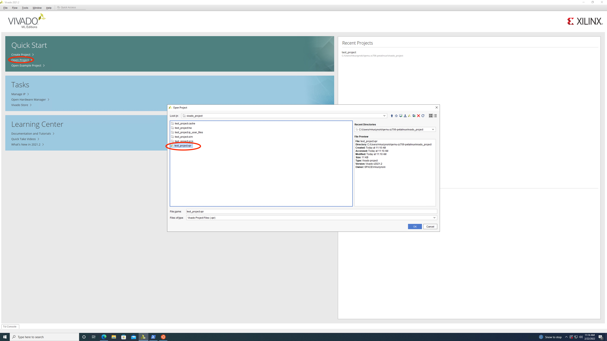
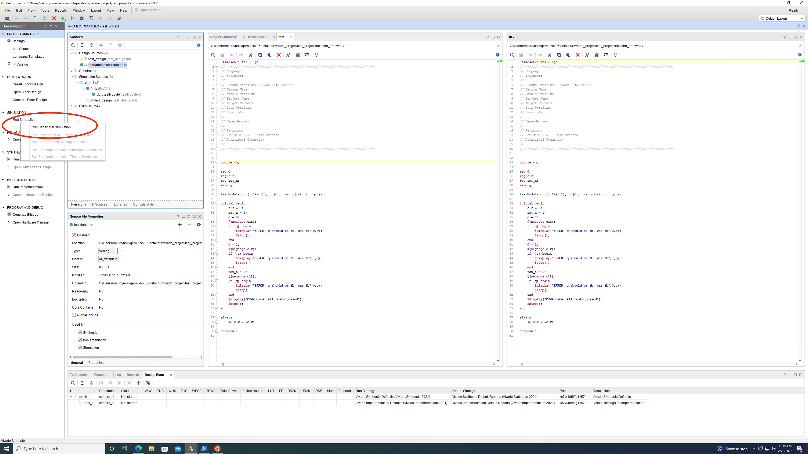
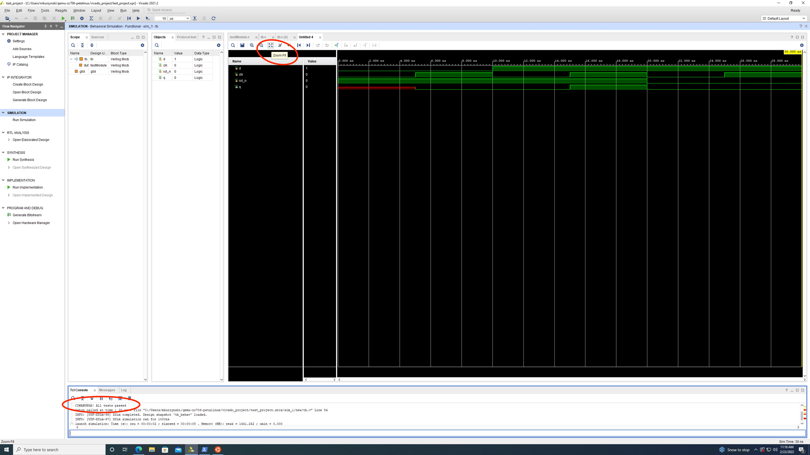
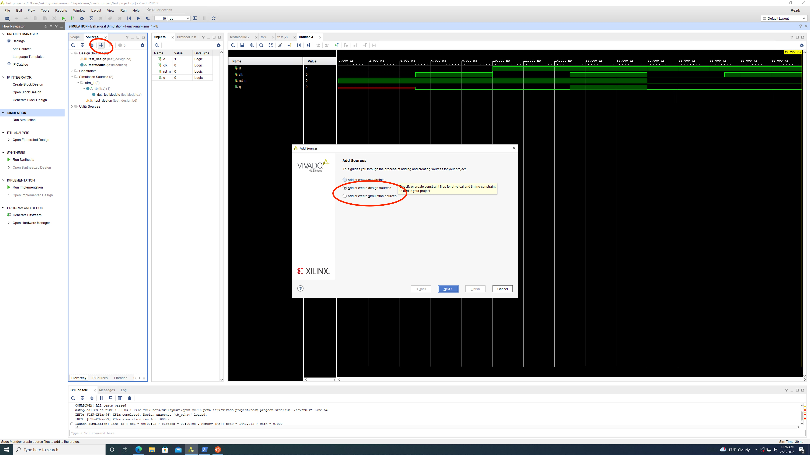

## Vivado Quickstart

_this is a short guide to run test benches, and add source files_

1) First, find the project folder, and select the project file

   
2) Sources shows the files. To simulate, click run simulation

   
3) This will open a new window. To see the whole wave, click zoom fit. `$display` and other print statements from the test bench can be seen in the console window.

   
4) To add simulation or design files, click the add sources button in the sources window, or File. Then select design or simulation source. You can ignore the options, because the inputs and outputs will be changed in the HDL files themselves.

   